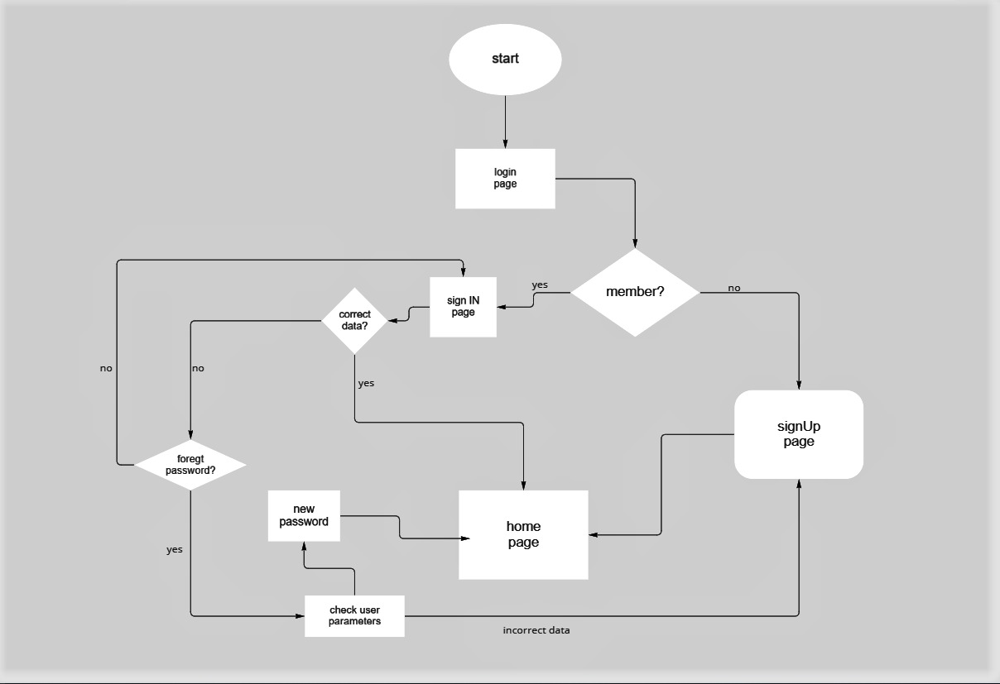

## _swimming club members_

the project will be for swimming club,
that you can signIn or signUp for the website club to see what new 


- in this project we will build a website as a group.
- a project for swimming club members.  

***
### Description
the reposrty include files that build the website
```sh
HTML files: Contains pages for building the interface
```
```sh
CSS files: Contains pages for disgn the website
```
```sh
JAVASCRIPT files:Contains all the functions that check authentication and other operations
```

---
### Installation
1. Copy the https repository: **team work-4 project**
2. open visual studio **terminal**
3. write Git Clone and paste the **URL**
4. type a command **code .**
---

## Flowchart of the project



***
## Contributing
If you have any questions or comments, you can open a issue or leave a comment.
***
## Contributors

This project was built by the talented students of development : **Neven**, **Ashraf**, **Rawad**, **Nareen**, **Omar**